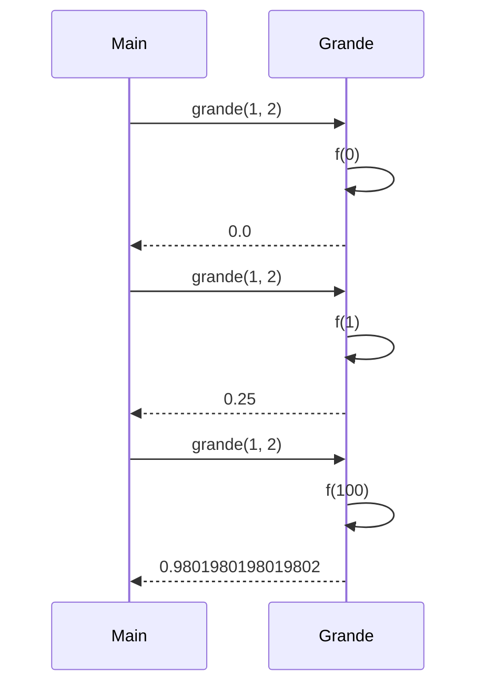

# Definición de Conjunto Difuso de Números Grandes

---

La función grande modela un conjunto difuso de números enteros considerados "grandes" según la fórmula $\left(\frac{n}{n+d}\right)^e$, donde:

$n$ es el número entero a evaluar.
$d$ es un número entero pequeño mayor o igual a 1.
$e$ es un entero mayor que 1 que ajusta el grado de pertenencia.
---


## Interpretación:

Si $n \leq 0$, el grado de pertenencia es 0.
Para $n > 0$, el valor $\left(\frac{n}{n+d}\right)^e$ se acerca a 1 a medida que $n$ crece, reflejando que números mayores son considerados "más grandes". El exponente $e$ modula la transición.

---
## Implementación en Scala 
```scala
  def grande(d: Int, e: Int): ConjDifuso = {
    def f(x: Int): Double = {
      if (x <= 0) 0.0
      else Math.pow(x.toDouble / (x + d), e)
    }
    f
  }

  def complemento(c: ConjDifuso): ConjDifuso = {
    def f(x: Int): Double = 1.0 - c(x)
    f
  }
```
La función grande recibe $d$ y $e$ como parámetros y retorna una función ConjDifuso que calcula el grado de pertenencia para cualquier entero $x$.

---
## Argumentación de Corrección
### Queremos demostrar que:
$$\forall n \in \mathbb{Z}, f_{\text{grande}}(n) = \begin{cases}
0 & \text{si } n \leq 0 \\
\left(\frac{n}{n+d}\right)^e & \text{si } n > 0
\end{cases}$$
## Caso Base
Para $n = 0$:

$f_{\text{grande}}(0) = 0.0$, lo cual es correcto según la definición.

Para $n = 1$ con $d = 1$, $e = 2$:

$f_{\text{grande}}(1) = \left(\frac{1}{1+1}\right)^2 = (0.5)^2 = 0.25$, que coincide con el cálculo.

## Caso Inductivo
Supongamos que $f_{\text{grande}}(k)$ es correcto para $k > 0$. Para $k + 1$:

$f_{\text{grande}}(k+1) = \left(\frac{k+1}{(k+1)+d}\right)^e$, que sigue la misma forma y es consistente con la definición, ya que el valor aumenta monotonicamente hacia 1 a medida que $k$ crece.

Por inducción, la función implementa correctamente el modelo difuso de "números grandes".

## Diagrama de Llamadas o de Pilas


## Conclusión para la Función grande
La función grande calcula correctamente el grado de pertenencia de un número entero al conjunto difuso de "números grandes" según la fórmula dada, con valores entre 0 y 1, y se aproxima a 1 para valores grandes de $n$.