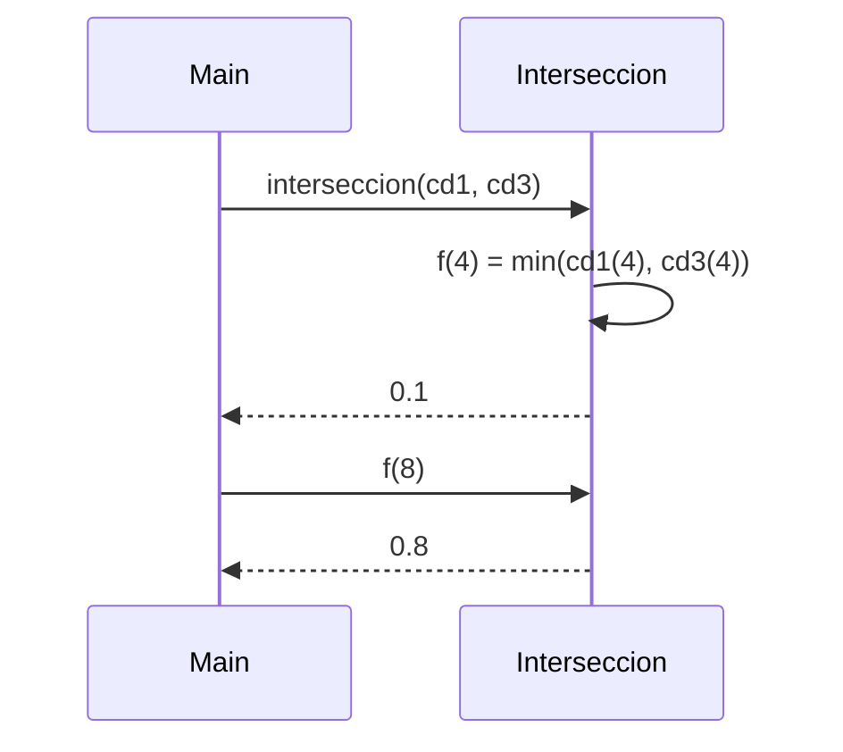

# Definición de Intersección de Conjuntos Difusos

---
La `intersección` de dos conjuntos difusos $A, B \subseteq U$ se define como:

$$f_{A \cap B}(x) = \min(f_A(x), f_B(x))$$

donde $U = [0, 1000]$ es el universo discreto, y $f_A(x)$, $f_B(x)$ representan los grados de pertenencia de $x$ en los conjuntos $A$ y $B$, respectivamente.

**Interpretación:**

- Si $f_A(x) = 0.7$ y $f_B(x) = 0.4$, entonces $f_{A \cap B}(x) = 0.4$.
- Si ambos conjuntos son altos en pertenencia, el resultado refleja el valor más `bajo` entre ellos.
- La intersección difusa representa el grado de pertenencia más restrictivo de los dos conjuntos.

---

## Implementación en Scala
```Scala
def interseccion(cd1: ConjDifuso, cd2: ConjDifuso): ConjDifuso = {
  def f(x: Int): Double = math.min(cd1(x), cd2(x))
  f
}
```

---
# Queremos demostrar que:
$$
\forall x \in U, \quad f_{A \cap B}(x) = \min(f_A(x), f_B(x))
$$

# Caso Base
Para $x = 0$, si $f_A(0) = 0.6$ y $f_B(0) = 0.3$:
$f_{A \cap B}(0) = \min(0.6, 0.3) = 0.3$, lo cual es correcto según la definición teórica.
# Caso Inductivo
Supongamos que $f_{A \cap B}(k) = \min(f_A(k), f_B(k))$ es correcto.
Para $k + 1$:
$f_{A \cap B}(k+1) = \min(f_A(k+1), f_B(k+1))$,
lo cual sigue la definición y mantiene la consistencia en todo el dominio.

Por inducción, la función interseccion implementa correctamente la operación de intersección difusa. 

---
# Diagrama de Pilas


---
# Conclusión
La función `interseccion` calcula correctamente la intersección difusa entre dos conjuntos, devolviendo valores dentro del rango $[0, 1]$ y respetando las propiedades teóricas.

Propiedades verificadas:

`Idempotencia`: $\text{interseccion}(A, A) = A$

`Conjunto Dominado`: $\text{interseccion}(A, \text{vacio}) = \text{vacio}$

`Conjunto Neutro`: $\text{interseccion}(A, \text{lleno}) = A$
