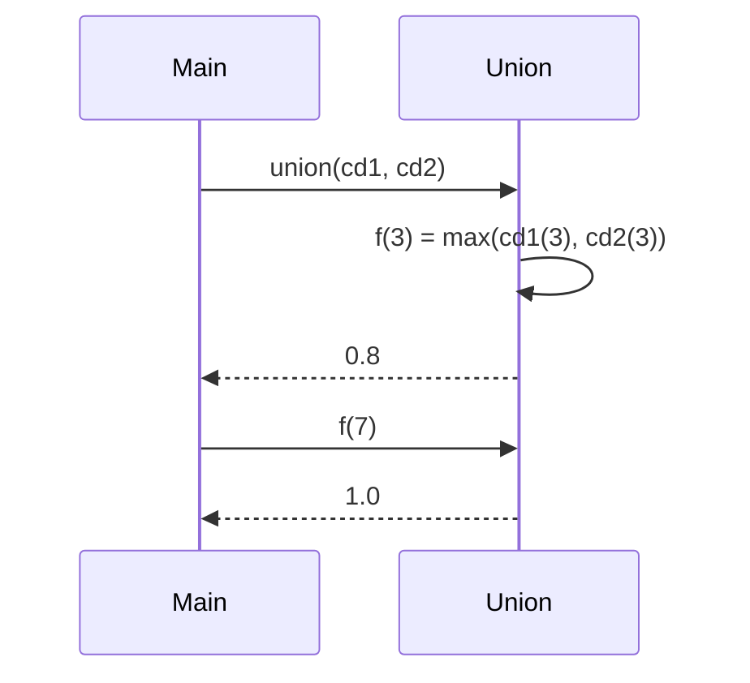

# Definición de Unión de Conjuntos Difusos

---
La `unión` de dos conjuntos difusos $A, B \subseteq U$ se define como:

$$f_{A \cup B}(x) = \max(f_A(x), f_B(x))$$

donde $U = [0, 1000]$ es el universo discreto, y $f_A(x)$, $f_B(x)$ representan los grados de pertenencia de $x$ en los conjuntos $A$ y $B$, respectivamente.

**Interpretación:**

- Si $f_A(x) = 0.7$ y $f_B(x) = 0.4$, entonces $f_{A \cup B}(x) = 0.7$.
- Si ambos conjuntos son bajos en pertenencia, el resultado refleja el valor más `alto` entre ellos.
- La unión difusa representa el grado de pertenencia más favorable de cada elemento en ambos conjuntos.

---

## Implementación en Scala
```Scala
def union(cd1: ConjDifuso, cd2: ConjDifuso): ConjDifuso = {
  def f(x: Int): Double = math.max(cd1(x), cd2(x))
  f
}
```
---
# Queremos demostrar que:

$$
\forall x \in U, \quad f_{A \cup B}(x) = \max(f_A(x), f_B(x))
$$

# Caso Base

Para $x = 0$, si $f_A(0) = 0.2$ y $f_B(0) = 0.5$:

$f_{A \cup B}(0) = \max(0.2, 0.5) = 0.5$, lo cual es correcto según la definición teórica.

# Caso Inductivo

Supongamos que $f_{A \cup B}(k) = \max(f_A(k), f_B(k))$ es correcto.
Para $k + 1$:

$f_{A \cup B}(k+1) = \max(f_A(k+1), f_B(k+1))$,
lo cual sigue la definición y mantiene la consistencia en todo el dominio.

Por inducción, la función union implementa correctamente la operación de unión difusa.

---
# Diagrama de Pilas

---
# Conclusión 

La función `union` calcula correctamente la unión difusa entre dos conjuntos, garantizando que el grado de pertenencia de cada elemento sea el máximo entre ambos.
Propiedades verificadas:

`Idempotencia`: $\text{union}(A, A) = A$

`Conjunto Neutro`: $\text{union}(A, \text{vacio}) = A$

`Conjunto Dominante`: $\text{union}(A, \text{lleno}) = \text{lleno}$