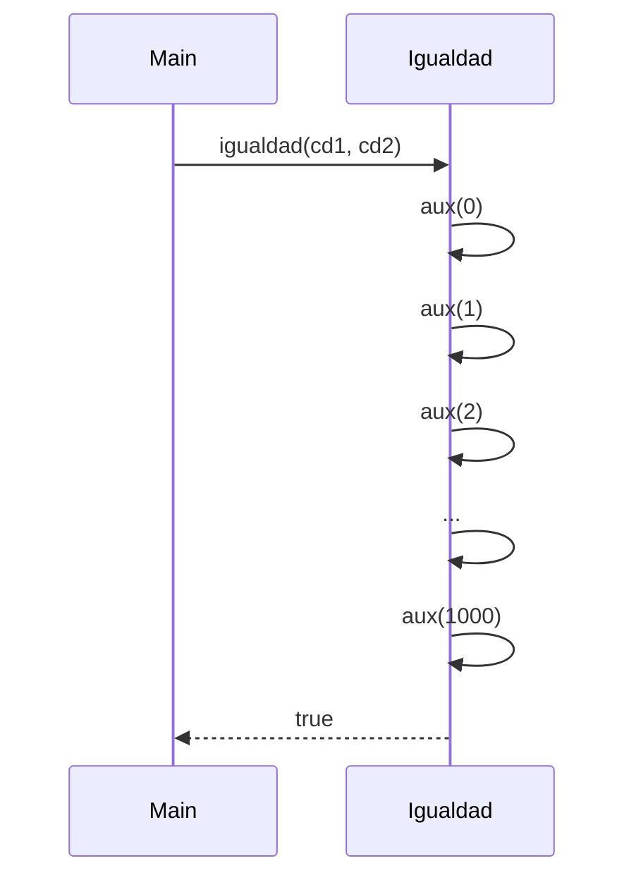

## Definición de Igualdad de Conjuntos Difusos

La igualdad entre dos conjuntos difusos `cd1` y `cd2` se define formalmente como:

$
cd1 = cd2 \iff \forall x \in U, cd1(x) = cd2(x)
$

donde $U = [0,1000]$ es el universo discreto de valores.

**Interpretación:**  
Esto significa que dos conjuntos difusos son iguales si, y sólo si, para cada elemento del dominio sus valores de pertenencia coinciden exactamente.
cada elemento $ x \in U $ sus grados de pertenencia son iguales.

---

Implementación en Scala

```scala
def igualdad(cd1: ConjDifuso, cd2: ConjDifuso): Boolean = {
  inclusion(cd1, cd2) && inclusion(cd2, cd1)
}
```

La función `igualdad` determina si dos conjuntos difusos $cd1$ y $cd2$ son equivalentes en todo el dominio $(0 \dots 1000)$:

```scala
def igualdad(cd1: ConjDifuso, cd2: ConjDifuso): Boolean = {
  @annotation.tailrec
  def aux(i: Int): Boolean = {
    if (i > 1000) true                
    else if (cd1(i) != cd2(i)) false  
    else aux(i + 1)                   
  }
  aux(0)
}
```

Argumentación de Corrección

Queremos demostrar que:

$
\forall S_1, S_2 \subseteq U : igualdad(S_1, S_2) == f(S_1, S_2)
$

donde $ f $ representa la definición teórica de igualdad difusa.

---

Caso Base de Igualdad

Para el valor inicial del dominio $i = 0$:

Si $ cd1(0) = cd2(0)$, la función continúa evaluando el siguiente índice.
 Si $ cd1(0) \neq cd2(0)$, la función retorna `false`, indicando que los conjuntos no son iguales.
Si $ i > 1000$, se retorna `true`, indicando que todos los elementos del dominio cumplen la igualdad.


Por tanto, el caso base garantiza:

$
igualdad(cd1, cd2) \Rightarrow \forall x \in [0,0],\ cd1(x) = cd2(x)
$

y coincide con la definición matemática de igualdad difusa para el primer elemento del dominio.


## Caso Inductivo de igualdad

Supongamos que para un valor $k$, la función `igualdad` es correcta hasta ese índice, es decir:

$
\forall x \le k, cd1(x) = cd2(x)
$

Ahora probemos que también se cumple para $k + 1$:

La función evalúa:


```scala
else if (cd1(i) != cd2(i)) 
  false 
else 
  aux(i + 1)
```


Si $ cd1(k+1) \neq cd2(k+1) $, entonces retorna `false`, cumpliendo la definición teórica de desigualdad.  
Si $ cd1(k+1) = cd2(k+1) $, continúa evaluando el siguiente elemento con `aux(k + 2)`.

Por inducción estructural sobre el dominio discreto $[0,1000]$:

$
igualdad(cd1, cd2) = true \iff \forall x \in U, cd1(x) = cd2(x)
$

---

## Conclusión para la Función igualdad

La función `igualdad(cd1, cd2)` compara directamente todos los elementos del dominio $[0,1000]$. Por lo tanto:

$
igualdad(cd1, cd2) = true \iff \forall x \in U, cd1(x) = cd2(x)
$

En otras palabras:

$
\forall cd1, cd2 \subseteq U : igualdad(cd1, cd2) \iff \forall x \in U, cd1(x) = cd2(x)
$

Esto garantiza que la función `igualdad` refleja exactamente la definición teórica de igualdad difusa.

---

## Propiedades Verificadas de igualdad

- **Reflexividad:**
  $
  igualdad(cd, cd) = true
  $

- **Simetría:**
  $
  igualdad(cd1, cd2) = igualdad(cd2, cd1)
  $

- **Transitividad:**
  $
  \text{Si } igualdad(cd1, cd2) \land igualdad(cd2, cd3) \Rightarrow igualdad(cd1, cd3)
  $

---
### Ejemplo de Ejecución

```scala
val cd1: ConjDifuso = x => if (x < 5) 0.2 else if (x < 10) 0.8 else 1.0
val cd2: ConjDifuso = x => if (x < 5) 0.2 else if (x < 10) 0.8 else 1.0

igualdad(cd1, cd2)
// Resultado: true

```
### Diagrama de Llamadas o de Pilas


## Conclusión General

- La función `igualdad` verifica completamente si dos conjuntos difusos son equivalentes mediante la comparación de todos sus elementos.

- Es determinista y confiable, porque evalúa recursivamente cada índice del dominio.

- Cumple las propiedades de una relación de equivalencia: reflexividad, simetría y transitividad.

Por lo tanto, se concluye que la función `igualdad` es `correcta` según la definición teórica de igualdad en conjuntos difusos.
